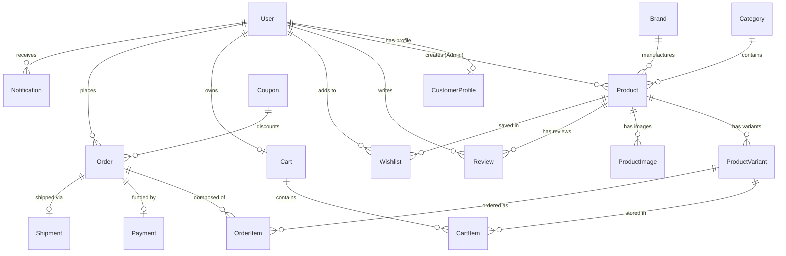

# Fashion & Apparel E-Commerce Management System (API-Based)

A backend-only, production-ready RESTful API platform for fashion businesses, clothing brands, boutiques, and independent vendors. Built with **Django** and **Django REST Framework (DRF)**, this e-commerce engine powers products, product variants, categories, inventory management, user registration, JWT-secured accounts, a shopping cart, a wishlist, coupons, orders, Paystack payment integration, delivery/shipment tracking, product reviews, email/system notifications, and a dedicated admin analytics dashboard.

---

## Table of Contents
1. [Tech Stack](#tech-stack)
2. [Project Setup & Installation](#project-setup--installation)
3. [Database Architecture & ER Diagram](#database-architecture--er-diagram)
4. [API Endpoints Reference](#api-endpoints-reference)
5. [Paystack Payment & Checkout Flow](#paystack-payment--checkout-flow)
6. [Testing & Coverage](#testing--coverage)
7. [API Documentation (Swagger/ReDoc)](#api-documentation-swaggerredoc)

---

## Tech Stack

*   **Framework**: Django & Django REST Framework (DRF)
*   **Authentication**: JSON Web Token (JWT) via `django-rest-framework-simplejwt`
*   **Database**: SQLite (Development) / PostgreSQL compatible
*   **API Documentation**: Swagger/OpenAPI 3.0 & ReDoc via `drf-spectacular`
*   **Filtering & Searching**: `django-filter` & DRF `filters.SearchFilter`
*   **Payment Gateway**: Paystack API integration
*   **Image Processing**: Pillow (for category, brand, and product image uploads)

---

## Project Setup & Installation

Follow these steps to run the project locally on your machine.

### Prerequisites
*   Python 3.10+
*   pip (Python package manager)

### 1. Clone & Navigate to Project Root
Ensure you are in the directory containing `manage.py`:
```bash
cd fashion_ecommerce_api
```

### 2. Create and Activate Virtual Environment
```bash
# On Windows
python -m venv myenv
.\myenv\Scripts\activate

# On macOS/Linux
python3 -m venv myenv
source myenv/bin/activate
```

### 3. Install Dependencies
Create a `requirements.txt` file (or verify if you have it) and run:
```bash
pip install django djangorestframework djangorestframework-simplejwt django-filter django-cors-headers pillow drf-spectacular requests
```

### 4. Database Migrations
Create database schemas and tables:
```bash
python manage.py makemigrations
python manage.py migrate
```

### 5. Create a Superuser (Admin Account)
To log in to the Django Admin panel and retrieve Admin-only endpoints, run:
```bash
python manage.py createsuperuser
```
Follow the prompts (enter email, username, and password). When logging in via API, remember that this system uses **email** as the primary authentication key.

### 6. Start the Development Server
```bash
python manage.py runserver
```
The API will be available at `http://127.0.0.1:8000/`.

---

## Database Architecture & ER Diagram

The system contains **17 database models** spanning across three apps (`accounts`, `store`, `orders`) designed to map standard clothing e-commerce interactions.

### ER Diagram (Mermaid)



### Model Schema Summary

1.  **User**: Extends `AbstractUser`. Standard fields + `role` (Admin/Customer) and `is_email_verified`. Primary username field is mapped to `email`.
2.  **CustomerProfile**: Stores shopper meta-information: `phone_number`, `address`, `city`, `country`. Linked 1-to-1 with `User`.
3.  **Category**: Product categories (e.g., Men, Women). Automatically generates a URL-friendly `slug` and supports category image uploads.
4.  **Brand**: Product brands (e.g., Nike, Gucci). Holds brand name, description, and logo.
5.  **Product**: Store products. Holds general details: category, brand, name, slug, description, price, discount_price, stock, and status (DRAFT / PUBLISHED).
6.  **ProductVariant**: Specific clothing size/color combinations. Features individual price overrides, stock levels, SKUs, and barcodes.
7.  **ProductImage**: Enables multiple image uploads for a product gallery. Markable with `is_primary`.
8.  **Review**: Product reviews (1-5 star ratings + comments) bound by user-product uniqueness.
9.  **Wishlist**: Users can save favorite products for later viewing.
10. **Cart**: User's shopping cart, linked to the user. Features a computed `total_price` property.
11. **CartItem**: Maps variant items to the cart with user-specified quantities.
12. **Coupon**: Configurable discounts (PERCENTAGE / FIXED) with active flags, date boundaries, and usage limits.
13. **Order**: Snapshot details of user purchases, shipping address, total and discount sums, coupon reference, and shipping status.
14. **OrderItem**: Captures items purchased inside an order and snapshots variant details and unit prices at checkout.
15. **Payment**: Payment information mapping order transactions with status (`PENDING`, `SUCCESSFUL`, `FAILED`, `REFUNDED`), references, and payment method details.
16. **Shipment**: Single tracking record per order covering carrier details, tracking numbers, estimated delivery dates, and delivery statuses.
17. **Notification**: Transactional email/system messages logged for user convenience.

---

## API Endpoints Reference

### 1. Authentication & Security
| Method | Endpoint | Description |
| :--- | :--- | :--- |
| **POST** | `/api/auth/register/` | Register a new customer |
| **POST** | `/api/auth/login/` | Log in and obtain JWT access & refresh tokens |
| **POST** | `/api/auth/refresh/` | Renew JWT access token using a refresh token |
| **POST** | `/api/auth/logout/` | Blacklist refresh token and log out user |
| **POST** | `/api/auth/verify-email/` | Request email verification link/token |
| **POST** | `/api/auth/verify-email/confirm/` | Submit verification code to confirm email |
| **POST** | `/api/auth/reset-password/` | Request password reset token |
| **POST** | `/api/auth/reset-password/confirm/` | Confirm password reset using token and new password |
| **GET** | `/api/accounts/profile/` | Retrieve logged-in user profile details |
| **PUT/PATCH** | `/api/accounts/profile/` | Edit profile details |
| **GET** | `/api/accounts/customers/` | List all registered customer accounts (Admin-only) |

### 2. Catalog & Products
| Method | Endpoint | Description |
| :--- | :--- | :--- |
| **GET** | `/api/categories/` | List product categories |
| **POST** | `/api/categories/` | Create a category (Admin-only) |
| **GET/PUT/DELETE** | `/api/categories/{id}/` | Retrieve, update, or delete category |
| **GET** | `/api/brands/` | List fashion brands |
| **POST** | `/api/brands/` | Create a brand (Admin-only) |
| **GET/PUT/DELETE** | `/api/brands/{id}/` | Retrieve, update, or delete brand |
| **GET** | `/api/products/` | List products (Filters: brand, category, variants) |
| **POST** | `/api/products/` | Create a product (Admin-only) |
| **GET/PUT/DELETE** | `/api/products/{id}/` | Retrieve, update, or delete product |
| **POST** | `/api/products/{id}/upload-images/` | Upload product gallery images (Admin-only) |
| **POST** | `/api/products/{id}/toggle-featured/` | Toggle featured status (Admin-only) |
| **POST** | `/api/products/{id}/publish/` | Publish a draft product (Admin-only) |
| **GET/POST** | `/api/products/variants/` | List/Create product variants (Admin-only for write) |
| **GET/PUT/DELETE** | `/api/products/variants/{id}/` | Retrieve, update, or delete product variant |

### 3. Shopping Cart & Wishlist
| Method | Endpoint | Description |
| :--- | :--- | :--- |
| **GET** | `/api/cart/` | View current user's shopping cart |
| **POST** | `/api/cart/` | Add variant to cart (`variant_id`, `quantity` required) |
| **PUT** | `/api/cart/{cart_item_id}/` | Update quantity of a cart item |
| **DELETE** | `/api/cart/{cart_item_id}/` | Delete cart item |
| **GET** | `/api/wishlist/` | View customer wishlist |
| **POST** | `/api/wishlist/` | Add product to wishlist |
| **DELETE** | `/api/wishlist/{wishlist_item_id}/` | Remove product from wishlist |

### 4. Orders, Coupons, and Payments
| Method | Endpoint | Description |
| :--- | :--- | :--- |
| **POST** | `/api/orders/` | Checkout shopping cart (`address`, optional `coupon_code`) |
| **GET** | `/api/orders/` | View order history (Customer views own; Admin views all) |
| **GET** | `/api/orders/{id}/` | View order details |
| **POST** | `/api/orders/{id}/cancel/` | Cancel a pending order (restores product variant stock) |
| **GET** | `/api/orders/{id}/invoice/` | Generate billing invoice details |
| **GET/POST** | `/api/coupons/` | List/create discount coupons (Admin-only for write) |
| **POST** | `/api/payments/initialize/` | Start a Paystack transaction for an order |
| **POST** | `/api/payments/verify/` | Verify Paystack payment by reference and update order |
| **GET** | `/api/payments/history/` | View transaction logs |
| **POST** | `/api/payments/{payment_id}/refund/` | Refund a payment and restore stock (Admin-only) |
| **GET/PUT/DELETE** | `/api/shipments/` | Manage shipments & update estimated delivery (Admin-only for write) |
| **GET** | `/api/notifications/` | View transaction notifications (Mark as read via `/read/` POST action) |
| **GET** | `/api/admin/analytics/` | View core business stats, sales, and low-stock indicators (Admin-only) |

---

## Paystack Payment & Checkout Flow

The platform handles secure payments using Paystack via reference handshake verification. Here is the step-by-step implementation flow:

```
[Customer]                            [Django API Server]                    [Paystack Gateway]
    |                                         |                                       |
    | 1. Checkout (POST /api/orders/)         |                                       |
    |---------------------------------------->|                                       |
    |                                         |                                       |
    | 2. Init Payment (POST /api/payments/initialize/)                                |
    |---------------------------------------->|                                       |
    |                                         | 3. Call Paystack Initialize Endpoint  |
    |                                         |-------------------------------------->|
    |                                         |                                       |
    |                                         | 4. Returns Init URL & Reference       |
    |                                         |<--------------------------------------|
    |                                         |                                       |
    | 5. Return Paystack payment URL          |                                       |
    |<----------------------------------------|                                       |
    |                                         |                                       |
    | 6. Customer makes payment on URL        |                                       |
    |-------------------------------------------------------------------------------->|
    |                                         |                                       |
    |                                         |                                       | 7. Completes payment
    |<--------------------------------------------------------------------------------|
    |                                         |                                       |
    | 8. Verify Payment (POST /api/payments/verify/ with reference)                  |
    |---------------------------------------->|                                       |
    |                                         | 9. Handshake check verification       |
    |                                         |-------------------------------------->|
    |                                         |                                       |
    |                                         | 10. Confirm Success                   |
    |                                         |<--------------------------------------|
    |                                         |                                       |
    |                                         |-- [Updates Order: status = 'PAID']    |
    |                                         |-- [Creates Payment & Shipment]        |
    |                                         |-- [Sends Transaction Notifications]   |
    |                                         |                                       |
    | 11. Return checkout success response    |                                       |
    |<----------------------------------------|                                       |
```

1.  **Create Order**: Customer posts to `/api/orders/`. System validates stock levels, applies coupons (if any), deducts stock, clears user's cart, and registers an order in `PENDING` status.
2.  **Initialize Payment**: Customer calls `/api/payments/initialize/` passing the `order_id`. The server initializes the transaction with the Paystack API using the order total, saves the `transaction_reference`, and returns a Paystack payment URL.
3.  **Customer Payment**: The customer pays via card/bank on the returned URL page hosted by Paystack.
4.  **Verification**: Once transaction finishes, the customer's client posts the `reference` to `/api/payments/verify/`. The API server queries Paystack's verify endpoint. Upon successful verification:
    *   The order status transitions to `PAID`.
    *   A `Payment` record is created as `SUCCESSFUL`.
    *   A `Shipment` record is created in `PENDING` status to queue delivery logistics.
    *   Email and system notifications are triggered for confirmation.

---

## Testing & Coverage

The repository features automated unit tests checking permissions, roles, edge cases, checkout stock deducts, and invoice generation.

### Run Tests
Make sure your virtual environment is active and run:
```bash
python manage.py test
```

### Coverage Scope
*   **Authentication & Security**: Registration, token handshakes, profile updating, password resets, and email verifications.
*   **Store & Catalog**: Admin/customer route restrictions, product variants creation, product searches, category filtering, user reviews, and wishlist activities.
*   **Orders & Checkout**: Cart manipulations, checkout validations, coupon-discount matching, automatic stock deductions, order cancellations (with stock restoration), automated invoice calculations, shipment logistics status updates, notifications, and admin analytics dashboards.

---

## API Documentation (Swagger/ReDoc)

Interactive API documentation and schemas are automatically generated using `drf-spectacular`.

When the server is running, you can access documentation at:
*   **Swagger UI**: `http://127.0.0.1:8000/api/docs/`
*   **ReDoc**: `http://127.0.0.1:8000/api/redoc/`
*   **OpenAPI Schema Download**: `http://127.0.0.1:8000/api/schema/`
